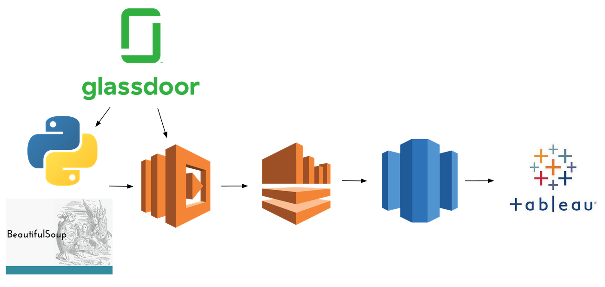

# Table of Contents
1. [Introduction](README.md#Introduction)
2. [Pipeline](README.md#Pipeline)
3. [Requirements](README.md#Requirements)
4. [Environment Setup](README.md#Environment%20Setup)
5. [Run Instructions](README.md#Run%20Instructions)

# Introduction
**Company QoLSearch: Search and compare company quality of life ratings in a flash!**

This is a project I completed in 3 weeks as part of the Insight Data Engineering Program during the NYC Summer 2019 session. The goal of the project is to create a dashboard that allows you to search and compare companies based on their quality of life ratings, such as work/life balance and benefits. The data used in the dashboard is obtained from scraping review data from Glassdoor.com. 

The dashboard can be accessed from my [website](makedatawork.us), where you can search for specific companies to compare their ratings as well as modify the weights of the ratings with a variety of options. It is designed to make it easy for jobseekers to compare ratings of companies they may be interested in working at, but can also be used by companies to view overall perception of companies by their employees, and see how their company measures up to others.

# Pipeline

The data was scraped from Glassdoor.com with an AWS Lambda function running a Python script using the BeautifulSoup library. It was then streamed through AWS Kinesis Data Stream and AWS Kinesis Data Firehose and stored in AWS Redshift data warehouse. The interactive front-end dashboard was created with Tableau Desktop. The entire pipeline aside from an initial Python script and the front-end is managed by AWS, so data does not need to be stored locally or on an online instance.

# Requirements

* Python 2.7
* Amazon AWS Account
* A JDBC or ODBC client tool, such as SQL Workbench/J

# Environment Setup

Clone [this repository](https://github.com/dc3033/Company-QoLSearch).

**Python**

The bs4, boto3, and requests libraries are required to run the initial Python script.

To install bs4 and requests, simply run these commands in the terminal of your choice:

pip install bs4

pip install requests

Instructions for installing and setting up boto3 can be found [here](https://pypi.org/project/boto3/).

**AWS Lambda**

Set up an IAM role with the 'AWSLambdaFullAccess', 'AWSKinesisFullAccess', and 'AWSLambdaKinesisExecutionRole' policies.

Create a Lambda function from scratch named 'scraperLambdaFunction', with Python 2.7 as runtime and the role you just created as execution role. On the next page, for code entry type, select 'Upload a .zip file' and upload lambdaScraper.zip from the cloned repository. Increase the memory to 512 mb and set the timeout to 15 minutes (max), then save.

Create another Lambda function from scratch named 'KinesisOutputFunction', with Node.js 10.x as runtime and the role you just created as execution role. Select 'Upload a .zip file' and upload lambdaKinesisOutput.zip from the cloned repository. Increase the memory to 256 mb and set the timeout to 20 seconds, then save.

Create one more Lambda function from scratch named 'LambdaInvokerAlarm', with Python 2.7 as runtime and the role you just created as execution role. Make sure the code entry type is 'Edit code inline', then copy and paste this code into the inline editor:

import json

def lambda_handler(event, context):
    print("Connection error on " + event)

then save.

**AWS Kinesis Data Stream**

From the AWS Kinesis dashboard, create a data stream named 'ReviewStream' and set the number of shards to 50.

**AWS Redshift**

From the AWS Redshift dashboard, select 'Clusters' in the sidebar, and then click on 'Launch cluster'. Fill in all the fields and remember them for later, but leave the database port as 5439. On the next page, select 'dc2.large' as node type, set cluster type to 'Multi Node', and set number of compute nodes to 2. On the next page, choose a VPC that is in the region nearest to you and select any security group for now. Click 'Continue', then 'Launch cluster'.

Make sure that the VPC you chose has a public subnet. Create a new security group for the VPC, and in the Inbound section, add a rule with 'Redshift' as the type, and in the source, type in the corresponding Kinesis CIDR block for the region as can be seen [on this page](https://docs.aws.amazon.com/firehose/latest/dev/controlling-access.html). 

Select your Redshift cluster from the 'Clusters' section, click on the 'Cluster' drop-down menu, select 'Modify cluster', and select the VPC security group that you just made, then click 'Modify'.

Connect to your Redshift database using your JDBC/ODBC client tool. You will need to download the Redshift [JDBC](https://docs.aws.amazon.com/redshift/latest/mgmt/configure-jdbc-connection.html#download-jdbc-driver) or [ODBC](https://docs.aws.amazon.com/redshift/latest/mgmt/install-odbc-driver-windows.html) drivers, and use the JDBC/ODBC URL to connect, which can be found by selecting your cluster and viewing its configuration.

Create a table with these columns:

company varchar(100), id int, postdate date, overallrating float, employeestatus varchar(100), worklifebalance float, cultureandvalues float, careeropportunities float, compensationandbenefits float, seniormanagement float

**AWS Kinesis Data Firehose**

From the AWS Kinesis dashboard, create a delivery stream named 'RedshiftStream', select 'Kinesis Stream' as source, and select 'ReviewStream'. Continue to the 'Choose Destination' page and select Amazon Redshift as destination. Choose the Redshift cluster you just created and fill in the required fields with the corresponding information. In the 'Columns' section, enter this:

overallrating, cultureandvalues, careeropportunities, worklifebalance, postdate, employeestatus, company, seniormanagement, id, compensationandbenefits

For the intermediate S3 destination, create a new bucket in the same region as your Redshift cluster. In the 'Copy Options' textbox, type this in:

format as json 'auto'

then click 'Next'. Make sure Error Logging is enabled, then press the 'Create new or choose' button in the IAM Role section. Select 'Create a new IAM role' and Allow. Click 'Next', then click 'Create delivery stream'.

**AWS CloudWatch**

If everything has been set up properly, you should be able to see AWS CloudWatch metrics for the Lambda functions and Kinesis streams, as well as logs for the Lambda functions. Here we will set up some alarms to send out email notifications in the event of errors.

Go to the Alarms page in CloudWatch and select 'Create Alarm', select the 'Errors' metric for KinesisOutputFunction, set 'Statistic' to 'Maximum', and set the condition to Greater/Equal than 5, then click 'Next'. Select the email list with the email you wish to receive notifications on, click 'Next', give the alarm an appropriate name, then click 'Next' and 'Create alarm'.

Repeat the above step, except with the 'Errors' metric for scraperLambdaFunction.

Repeat the above step, except with the 'Invocations' metric for LambdaInvokerAlarm, and set the condition to Greater than 0.

Repeat the above step, except with the 'DeliveryToRedshift.Success' metric for RedshiftStream, and set the condition to Less than 1.

Now you have alarms for when something goes wrong with the Lambda functions, the initial Python script, and the data transfer between Firehose and Redshift. The Lambda function alarms may go off during initial startup of the scraping, but I haven't noticed any actual errors from that.

# Run Instructions

If everything has been set up properly, all you need to do is run lambda_invoker.py, which will start up the web scraper. If you want to change the number of companies to scrape data from, just change the 'mainPageLimit' variable in the script.
